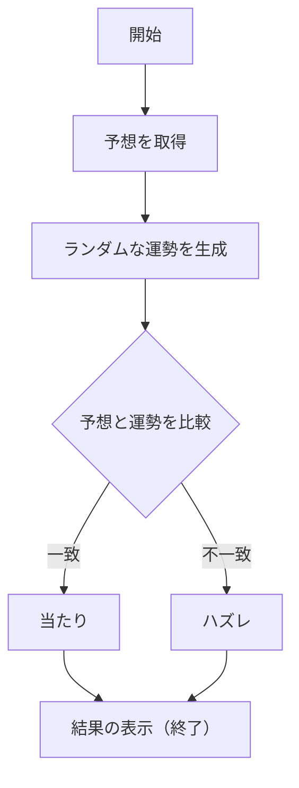
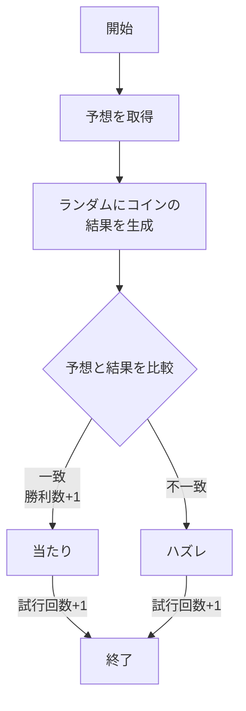
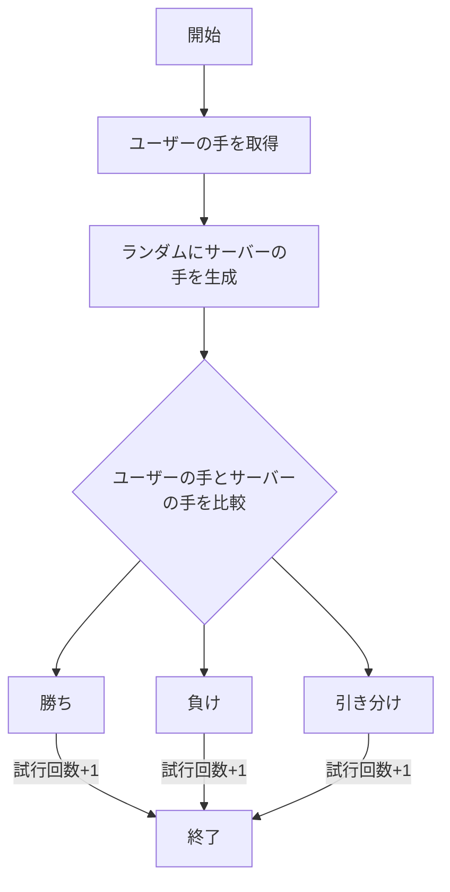

# app5.js

## 1. アプリケーションの初期設定
```javascript
const express = require("express");
const app = express();
```
・```express``` モジュールをインポートして，アプリケーションオブジェクト```app```を作成する．このオブジェクトを使用してルーティングやミドルウェアを定義し，リクエストに対してレスポンスを返す．

## 2. ルーティング（GETメソッドによる処理）
```/hello1```ルート

```javascript
app.get("/hello1", (req, res) => {
  const message1 = "Hello world";
  const message2 = "Bon jour";
  res.render('show', { greet1: message1, greet2: message2 });
});
```
・GET /hello1 リクエストに対して，2つの挨拶メッセージをテンプレートに渡して表示する．```show.ejs```テンプレートにgreet1とgreet2という2つのメッセージを渡し，HTMLにレンダリングする．


```/hello2```ルート
```javascript
app.get("/hello2", (req, res) => {
  res.render('show', { greet1: "Hello world", greet2: "Bon jour" });
});
```

・```/hello2```ルートでは，固定の挨拶メッセージ "Hello world" と "Bon jour" をテンプレートに渡して表示する．

## 3./luck (おみくじ)

```javascript
app.get("/luck", (req, res) => {
  let userGuess = req.query.omikuji; // ユーザの予想
  const num = Math.floor(Math.random() * 6 + 1); // ランダムで1から6の数を生成
  let luck = '';

  // 運勢を決定
  switch(num) {
    case 1: luck = '大吉'; break;
    case 2: luck = '中吉'; break;
    case 3: luck = '小吉'; break;
    case 4: luck = '吉'; break;
    case 5: luck = '末吉'; break;
    case 6: luck = '凶'; break;
  }

  // 勝敗判定
  let judgement = (userGuess === luck) ? '当たり！' : '残念、ハズレ。';

  // 結果をテンプレートに渡して表示
  res.render('luck', { number: num, luck: luck, judgement: judgement });
});
```
機能
・```/luck```ルートは,ユーザーの予想 (req.query.omikuji) を取得し,1から6までのランダムな数値に基づいて運勢を決定する．
・決定した運勢とユーザーの予想を比較し，当たり/ハズレを判定する．その結果を```luck.ejs```に渡して表示.

手順
1. ```node app5.js```でプログラムを起動する
1. Webブラウザで```localhost:8080/public/luck.html```にアクセスする
1. ユーザーが運勢を予想する
1. ランダムで決定した運勢と自分の予想を比較する



## 4./coin (コイントス)
```javascript
app.get("/coin", (req, res) => {
  let userGuess = req.query.coin; // ユーザの予想
  let total = Number(req.query.total) || 0; // トスの回数（初期値0）
  let win = Number(req.query.win) || 0; // 勝利数（初期値0）

  const coinFlip = Math.floor(Math.random() * 2); // ランダムで表か裏を決定
  let result = (coinFlip === 0) ? '表' : '裏';

  // 勝敗判定
  let judgement = (userGuess === result) ? '当たり！' : '残念、ハズレ。';
  if (userGuess === result) win += 1; // 当たりの場合は勝利数を増加
  total += 1; // トス回数を増加

  // 結果をテンプレートに渡して表示
  res.render('coin', { result: result, judgement: judgement, win: win, total: total });
});
```
機能
・ユーザーが予想した表か裏(```req.query.coin```)を取得し、ランダムに表 (0) か裏 (1) を生成する

手順
1. ```node app5.js```でプログラムを起動する
1. Webブラウザで```localhost:8080/public/coin.html```にアクセスする
1. 表か裏か予想する
1. ランダムで決定した運勢と自分の予想を比較し，当たりかハズレを判定する
1. 勝敗を判定し，勝利数と試行回数をカウントをする



## 5, /janken(じゃんけん)

```javascript
app.get("/janken", (req, res) => {
  let hand = req.query.hand; // ユーザの手
  let win = Number(req.query.win) || 0; // 勝利数
  let total = Number(req.query.total) || 0; // 総試合数
  console.log({ hand, win, total });

  const num = Math.floor(Math.random() * 3 + 1); // CPUの手をランダムに生成
  let cpu = (num === 1) ? 'グー' : (num === 2) ? 'チョキ' : 'パー';

  // 勝敗の判定
  let judgement = '';
  if (hand === 'グー' && cpu === 'チョキ' || hand === 'チョキ' && cpu === 'パー' || hand === 'パー' && cpu === 'グー') {
    judgement = '勝ち';
    win += 1; // 勝利数を増加
  } else if (hand === cpu) {
    judgement = '引き分け';
  } else {
    judgement = '負け';
  }

  total += 1; // 総試合数をカウント

  // 結果をテンプレートに渡して表示
  res.render('janken', { your: hand, cpu: cpu, judgement: judgement, win: win, total: total });
});
```

機能
・ユーザーの出した手 (```req.query.hand```) とCPUの手（ランダムに生成）を比較して勝敗を判定する

手順
1. ```node app5.js```でプログラムを起動する
1. Webブラウザで```localhost:8080/public/janken.html```にアクセスする
1. 自分の出す手を入力
1. 勝敗を判定し，勝利数と総試合数をカウントする



## 6,サーバーの起動
```javascript
app.listen(8080, () => console.log("Example app listening on port 8080!"));
```
このコードにより、Expressアプリケーションがポート8080でリッスン（待機）する．